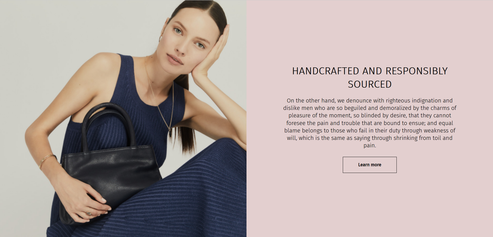

# 📱 Image and Text
* Small project consisting of one image and some text
* The project was made by this design on figma: [Image + Text](https://www.figma.com/file/5JTNUasYOPVaGL57ahb2H3/Untitled?node-id=0%3A1)
* The project was built to work well on every device while retaining pixel-perfect design and having added functionality
* implemented SEO

# 👉 Built With
* HTML5
* CSS3
* JS

# 💻 Development
1. git clone https://github.com/DanijelAdrinek/Image-and-Text.git
2. run the HTML file in a browser